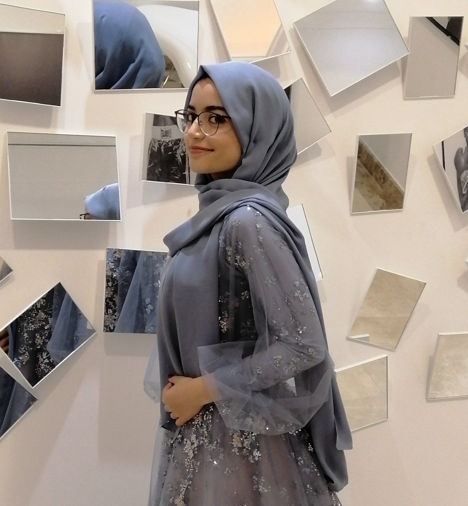
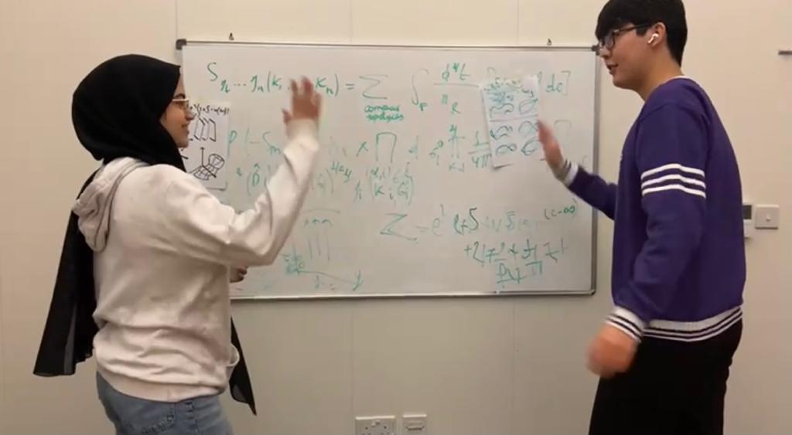

# Documentation of 30MFF Website  
# Interstellar Revolution

## Working Link: https://aibartt.github.io/Assignment1/

## Project Description

## Overview

In this assignment we had to create a web page to house and debut our 30MFF. I thought that creating a story and branding the film using my website would be a good idea. My 30MFF website tells the story of two scientist Aibar and Mira who solved the String theory. With their newfound understanding of the universe, they were able to develop a way to travel faster than the speed of light. This revolutionary breakthrough would allow humans to travel to distant galaxies, and explore the infinite possibilities of the universe. In my website I added various intersting sections like Mission Crew Profiles, Galactic Story, String Theory and etc. Additionally, I incorporated a element of "interactivity" on the page by adding a "photo carousel" where Behind The Scenes photos change upon clicking and Buttons to navigate to different sections using JavaScript.

## Concept and Theme

The story of Aibar and Mira is a tale of scientific discovery, human perseverance, and the quest for knowledge. It is a story about two brilliant scientists who devoted their lives to solving the mysteries of string theory, and in doing so, found the key to controlling the fabric of reality and saving humanity from extinction. The space theme in the story of Aibar and Mira highlights the vastness and wonder of the universe and the human desire to explore it. The Interstellar Revolution, which was built based on the principles of string theory, opened up the possibility of space travel and allowed humanity to venture out into the cosmos. This theme touches on the human fascination with space and the unknown, and the drive to explore and discover what lies beyond our planet. I decided to use elements of the film in the design of the site and included many space-themed background pictures. I was also inspired by Star Wars Opening Scenes and integrated a similar design in my Galactic Story section.

## Experience 

In this assignment, I strived to create the best possible immersive experience for the user. I specifically implemented design elements and decisions that depict the Space Concept and Theme to the users. All the background pictures illustrate different galaxies, clusters, and string theory imitations. In order to convey the full story to the users I included the Galactic Story section which gives the necessary context to the embedded video. For the users who are new to String Theory, I created a website explaining the basics of this physical theory. For the people curious about these two brilliant scientists there is a Crew Mission page with their Profile pictures and information. You can also contact them via email if you want :) All this work has been done to achieve the best possible immersive and complete experience for the end user.

## Implementation Process

In order to implement this Assignment, I used standard tech stack consisting of HTML, CSS and JavaScript. I created main index.html page and added the navigation bar at the header. Clicking different buttons in the header will navigate you to 3 different .html pages for Crew Mission, String Theory, Contact sections. See below code:

  <header class="header-border">
    
    <!-- Adding the logo image to the header of website -->
    

    <!-- If you click on the  Interstellar Revolution it would navigate you to main page-->
    <a class="plain-link" href="index.html">
      <h1 class="logo"> Interstellar Revolution </h1>
    </a>

    <!-- I added the navigation Links to three diferent html pages with additional information -->
    <nav>
      <ul class="nav_links">
        <!-- Clicking the buttons will navigate you to specific .html pages with necessary info -->
        <li><a href="crew.html"><button>Mission Crew</button></a></li> 
        <li><a href="about.html"><button>About String Theory</button></a></li>
        <li><a class="cta" href="contact.html"><button>Contact</button></a></li>
      </ul>
    </nav>

  </header>
 
 For the Crew Mission section I used HTML and CSS to create imaginary description and circular profile picture.
  
    

      <!-- Profiles of the two scientists with imaginary description and circular profile picture -->
      

        
        <h1>Aibar</h1>
        
Aibar is a renowned physicist who is best known for his groundbreaking work in string theory. He has dedicated his life to solving the mysteries of the universe and is considered one of the leading experts in his field. Along with his partner, Mira, Aibar discovered the key to controlling the fabric of reality and built the Interstellar Revolution, a machine that allowed humanity to travel through space and time.

      

      

        
        <h1>Mira</h1>
        
Mira is a celebrated physicist who rose to fame for her work on string theory and the Interstellar Revolution. She has a passion for unlocking the secrets of the universe and has dedicated her life to solving the mysteries of theoretical physics. Her contributions to science have been widely recognized and she continues to inspire future generations with her relentless drive for knowledge and exploration.

      

    

For the interactivity I decided to incorporate a "photo carousel" where Behind The Scenes photos change upon clicking and Buttons to navigate to different sections using JavaScript. First I created Previous and Next buttons and assigned them ids to later access it through JavaScript. 
  
  

    <!-- Previous button to navigate to the previous image -->
    

      <button id="previousButton">Previous</button>
      <!-- Image that will be displayed in the carousel -->
      
      <!-- Next button to navigate to the next image -->
      <button id="nextButton">Next</button>
    

  

  
Then I added the logic in app.js. I made an array of image filenames and currentIndex variable to keep track of the current image index. The logic was to add a click event listener to the next and previous buttons and update the current image by either incrementing or decrementing the current index.

      // An array of image filenames
      const images = ['Images/1.jpeg', 'Images/2.jpeg', 'Images/3.jpeg', 'Images/4.jpeg', 'Images/5.jpeg'];

      // Select the elements we need to manipulate
      const currentImage = document.querySelector('#currentImage');
      const previousButton = document.querySelector('#previousButton');
      const nextButton = document.querySelector('#nextButton');

      // Keep track of the current image index
      let currentIndex = 0;

      // Set the initial image
      currentImage.src = images[currentIndex];

      // Add a click event listener to the previous button
      previousButton.addEventListener('click', function() {
        // Decrement the current index
        currentIndex = currentIndex - 1;

        // If we've gone below the first image, wrap around to the last image
        if (currentIndex < 0) {
          currentIndex = images.length - 1;
        }

        // Update the current image
        currentImage.src = images[currentIndex];
      });

      // Add a click event listener to the next button
      nextButton.addEventListener('click', function() {
        // Increment the current index
        currentIndex = currentIndex + 1;

        // If we've gone past the last image, wrap around to the first image
        if (currentIndex >= images.length) {
          currentIndex = 0;
        }

        // Update the current image
        currentImage.src = images[currentIndex];
      });

## Reflection and Evaluation

Surprisingly most of the expectations and goals were met in the process of building the final working version of this project. All the set goals and functionalities of the initial wireframe were succesfully designed and implemented in my website. Additionally, new ideas and design solutions were integrated in new website. For example navigation buttons in the header and three additional sections of Crew Mission, About String Theory and Contact. I learned a lot of new tecniques and insights into creating a engaging and interactive websites using .html, .css and .js. Through this project I learnt how powerful can be JavaScript and CSS and how they can significantly enhance the level of UI and UX.
