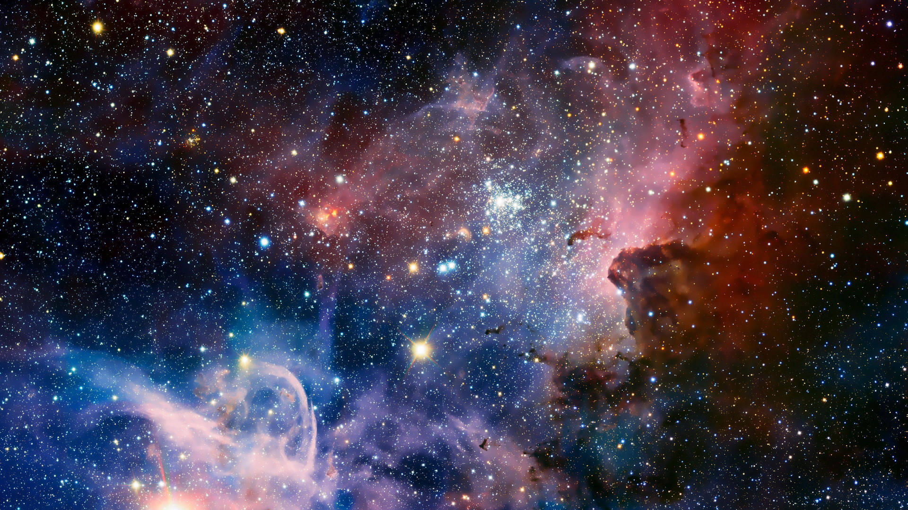

# Documentation of 30MFF Website  
# Intersteellar Revolution

## Working Link: https://aibartt.github.io/Assignment1/

## Project Description

## Overview

In this assignment we had to create a web page to house and debut our 30MFF. I thought that creating a story and branding the film using my website would be a good idea. My 30MFF website tells the story of two scientist Aibar and Mira who solved the String theory. With their newfound understanding of the universe, they were able to develop a way to travel faster than the speed of light. This revolutionary breakthrough would allow humans to travel to distant galaxies, and explore the infinite possibilities of the universe. In my website I added various intersting sections like Mission Crew Profiles, Galactic Story, String Theory and etc. Additionally, I incorporated a element of "interactivity" on the page by adding a "photo carousel" where Behind The Scenes photos change upon clicking and Buttons to navigate to different sections using JavaScript.

## Concept and Theme

The story of Aibar and Mira is a tale of scientific discovery, human perseverance, and the quest for knowledge. It is a story about two brilliant scientists who devoted their lives to solving the mysteries of string theory, and in doing so, found the key to controlling the fabric of reality and saving humanity from extinction. The space theme in the story of Aibar and Mira highlights the vastness and wonder of the universe and the human desire to explore it. The Interstellar Revolution, which was built based on the principles of string theory, opened up the possibility of space travel and allowed humanity to venture out into the cosmos. This theme touches on the human fascination with space and the unknown, and the drive to explore and discover what lies beyond our planet. I decided to use elements of the film in the design of the site and included many space-themed background pictures. I was also inspired by Star Wars Opening Scenes and integrated a similar design in my Galactic Story section.

## Experience 

In this assignment, I strived to create the best possible immersive experience for the user. I specifically implemented design elements and decisions that depict the Space Concept and Theme to the users. All the background pictures illustrate different galaxies, clusters, and string theory imitations. In order to convey the full story to the users I included the Galactic Story section which gives the necessary context to the embedded video. For the users who are new to String Theory, I created a website explaining the basics of this physical theory. For the people curious about these two brilliant scientists there is a Crew Mission page with their Profile pictures and information. You can also contact them via email if you want :) All this work has been done to achieve the best possible immersive and complete experience for the end user.

